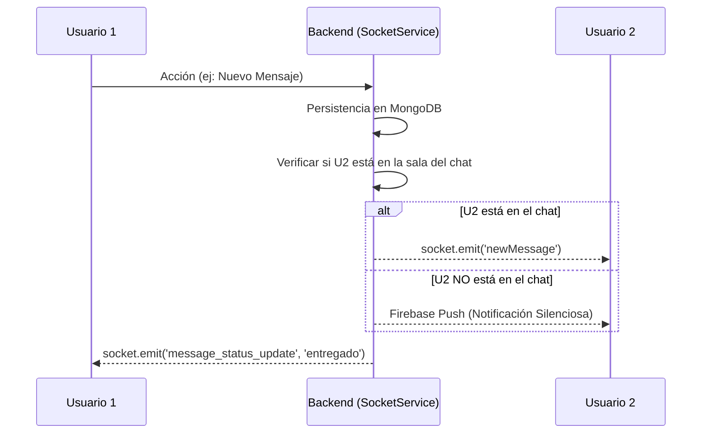

# ✅ Implementación de Socket.IO - Backend V2

**Fecha: 6 de Noviembre, 2025**
**Versión: 2.1.0**

**Fecha:** 20 de Abril, 2026
**Versión:** 2.3.5 (Actualizado con Presencia y ACKs)
**Estado:** ✅ COMPLETADO Y OPTIMIZADO

---

> [!TIP]
> ### 💡 RECOMENDACIONES DE ARQUITECTURA (V2.3)
> * **Uso de Salas:** Priorizar siempre la sala `user:${userId}` para comunicaciones directas. Es más confiable que las salas temáticas.
> * **Optimización de DB:** Al actualizar estados (como `isOnline`), usar `User.collection.updateOne` para evitar la carga masiva de esquemas pesados (23KB+) en memoria.
> * **Deduplicación:** El Frontend debe manejar `clientMessageId` para evitar duplicados visuales al recibir sus propios mensajes vía socket.
> * **Escalabilidad:** Si el tráfico crece, el siguiente paso es migrar el `connectedUsers` Map a un **Redis Adapter**.

---

## 🎯 Objetivos Cumplidos

1. ✅ **Socket.IO instalado y configurado** (Puerto 3001)
2. ✅ **Autenticación JWT** obligatoria para inicializar el socket.
3. ✅ **Sistema de notificaciones y mensajería** en tiempo real.
4. ✅ **Gestión de Presencia** (Online/Offline) con notificación a amigos.
5. ✅ **Indicadores de escritura y ACKs** (Mensajes entregados/leídos).

---

## 📦 Dependencias
`npm install socket.io`

---

## 🔧 Estructura del Backend

### 1. **Core: `src/services/socketService.js`**
Toda la lógica se ha centralizado en una clase `SocketService` para mantener el orden.

**Funciones Globales Disponibles:**
```javascript
// Emitir notificación a sala 'user:'
global.emitNotification(userId, notification);

// Emitir mensaje a sala 'conversation:' + sala personal de participantes
global.emitMessage(conversationId, message, participantsArray);

// Actualizaciones automáticas (Grupos, Reuniones, Posts)
global.emitGroupMessage(groupId, message);
global.emitMeetingUpdate(attendeeIds, meeting, type);
global.emitPostUpdate(post); // Avisa al autor y a sus amigos
```

### 2. **Gestión de Salas (Rooms)**
| Sala | Propósito |
| :--- | :--- |
| `user:${userId}` | Sala Maestra para todo lo dirigido al usuario. |
| `notifications:${userId}` | Legacy: Suscripción a alertas. |
| `conversation:${id}` | Eventos específicos dentro de un chat (typing, read). |
| `group:${id}` | Actividad dentro de un grupo. |

---

## 🔧 Integración en Frontend

### 1. **Librería: `src/shared/lib/socket.js`**
Maneja la reconexión y autenticación automática enviando el JWT en el evento `authenticate`.

### 2. **Escuchar Eventos (Ejemplo)**
```javascript
socket.on('newNotification', (notification) => {
  // Manejo de la notificación recibida en tiempo real
});

socket.on('friend_status_changed', ({ userId, isOnline }) => {
  // Actualizar indicador verde/gris de amigos
});
```

---

## 🔐 Seguridad Implementada
1. **JWT Verification:** Se verifica el token en cada evento de autenticación.
2. **Room Protection:** No se puede unir a salas de otros usuarios; el sistema valida el `userId` decodificado del token.
3. **CORS:** Restringido a dominios de confianza (`degadersocial.com` y localhost).

---

## 📊 Flujo de Datos (Tiempo Real)



---

## 🧪 Pruebas y Testing

### **1. Test de Salud**
`GET http://localhost:3001/health`
Debe devolver el estado de `socketio: enabled`.

### **2. Logs de Debugging**
El servidor emite logs detallados para rastrear el flujo:
- `🔌 Cliente conectado`
- `🔐 [AUTH] Usuario autenticado: ...`
- `📡 [NOTIFY] Notificando a amigos sobre conexión`
- `📨 Notificación emitida a usuario ...`

---

## 📝 Reglas de Mantenimiento
1. **Nunca** emitir eventos sensibles sin validar la sesión.
2. Al añadir un nuevo tipo de evento, documentarlo en la tabla de Salas.
3. Asegurarse de que `socketService.initialize(io)` se llame en `index.js` **después** de que la conexión a MongoDB sea exitosa.

---

**Documentación Reconstruida y Mejorada por:** Antigravity AI
**Ubicación original:** docs/SOCKET_IO_IMPLEMENTATION.md
