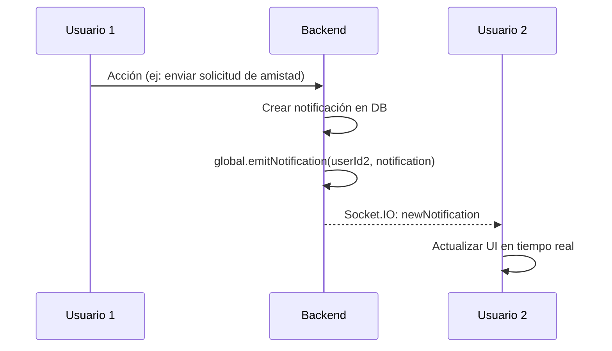

# ✅ Implementación de Socket.IO - Backend V2

**Fecha:** 6 de Noviembre, 2025
**Versión:** 2.1.0
**Estado:** ✅ COMPLETADO

---

## 🎯 Objetivos Cumplidos

1. ✅ **Socket.IO instalado y configurado** en backend V2
2. ✅ **Autenticación JWT** para sockets implementada
3. ✅ **Sistema de notificaciones en tiempo real** funcionando
4. ✅ **Sistema de mensajes en tiempo real** preparado
5. ✅ **Frontend actualizado** para conectarse al Socket.IO

---

## 📦 Dependencias Instaladas

```bash
npm install socket.io
```

**Paquetes necesarios:**
- `socket.io` - Servidor WebSocket (backend)
- `socket.io-client` - Cliente WebSocket (ya instalado en frontend)

---

## 🔧 Cambios en Backend

### 1. **Archivo: `src/index.js`**

**Cambios principales:**
- Servidor HTTP creado con `createServer()`
- Socket.IO inicializado con configuración CORS
- Autenticación JWT para sockets
- Manejo de eventos en tiempo real
- Funciones globales para emitir notificaciones

**Características implementadas:**

#### **a) Autenticación de Socket**
```javascript
socket.on('authenticate', async (data) => {
  const { token } = data;
  const decoded = jwt.verify(token, process.env.JWT_SECRET);
  socket.userId = decoded.userId;
  connectedUsers.set(userId.toString(), socket.id);
});
```

#### **b) Suscripción a Notificaciones**
```javascript
socket.on('subscribeNotifications', ({ userId }) => {
  socket.join(`notifications:${userId}`);
});
```

#### **c) Suscripción a Conversaciones**
```javascript
socket.on('subscribeConversation', ({ conversationId }) => {
  socket.join(`conversation:${conversationId}`);
});
```

#### **d) Funciones Helper Globales**
```javascript
// Emitir notificación a un usuario específico
global.emitNotification = (userId, notification) => {
  io.to(`notifications:${userId}`).emit('newNotification', notification);
};

// Emitir mensaje a una conversación específica
global.emitMessage = (conversationId, message) => {
  io.to(`conversation:${conversationId}`).emit('newMessage', message);
};
```

#### **e) Monitoreo de Conexiones**
- Map de usuarios conectados: `connectedUsers`
- Tracking de socketId por userId
- Logs detallados de conexión/desconexión

---

## 🔧 Cambios en Frontend

### 1. **Archivo: `src/shared/lib/socket.js`**

**Actualizaciones:**

#### **a) Autenticación Manual**
```javascript
socket.on('connect', () => {
  if (token) {
    socket.emit('authenticate', { token });
  }
});

socket.on('authenticated', (data) => {
  console.log('✅ Socket autenticado:', data);
});
```

#### **b) Eventos de Notificaciones**
```javascript
socket.on('newNotification', (notification) => {
  console.log('📨 Nueva notificación recibida:', notification);
  window.dispatchEvent(new CustomEvent('socket:notification:new', {
    detail: notification
  }));
});
```

#### **c) Eventos de Mensajes**
```javascript
socket.on('newMessage', (message) => {
  console.log('💬 Nuevo mensaje recibido:', message);
  window.dispatchEvent(new CustomEvent('socket:message:new', {
    detail: message
  }));
});
```

### 2. **Archivo: `src/features/notificaciones/components/NotificationsDropdown.jsx`**

**Sin cambios necesarios** - Ya estaba preparado para:
- Suscripción automática con `socket.emit('subscribeNotifications')`
- Manejo de evento `newNotification`
- Actualización de estado en tiempo real

---

## 🔐 Seguridad Implementada

### 1. **Autenticación de Sockets**
- Verificación de token JWT antes de permitir suscripciones
- Asociación userId <-> socketId segura
- Desconexión automática si el token es inválido

### 2. **Autorización de Eventos**
- Solo usuarios autenticados pueden suscribirse a notificaciones
- Las notificaciones se emiten solo al usuario propietario
- Las salas de Socket.IO usan prefijos: `notifications:userId`, `conversation:conversationId`

### 3. **CORS Configurado**
```javascript
cors: {
  origin: [
    'http://localhost:5173',  // Vite dev
    'http://localhost:5174',  // Vite alternate
    'http://localhost:3000'   // React dev
  ],
  methods: ['GET', 'POST'],
  credentials: true
}
```

---

## 📊 Flujo de Notificaciones en Tiempo Real

### **Backend → Frontend**



### **Ejemplo de Uso en Código Backend**

```javascript
// En cualquier ruta o controlador
const notification = await Notification.create({
  usuario: destinatarioId,
  tipo: 'solicitud_amistad',
  remitente: remitenteId,
  mensaje: 'Te envió una solicitud de amistad'
});

// Emitir en tiempo real
global.emitNotification(destinatarioId, notification);
```

---

## 🚀 Cómo Usar Socket.IO

### **1. En Controladores/Rutas Backend**

#### **Ejemplo: Notificación de Solicitud de Amistad**
```javascript
// En friendship.routes.js o similar
const { io } = require('../index');

async function sendFriendRequest(req, res) {
  const { recipientId } = req.body;
  const senderId = req.user._id;

  // Crear la solicitud...
  // Crear notificación...

  // Emitir en tiempo real
  global.emitNotification(recipientId, {
    _id: notificationId,
    tipo: 'solicitud_amistad',
    remitente: senderData,
    mensaje: 'Te envió una solicitud de amistad',
    createdAt: new Date()
  });

  res.json({ success: true });
}
```

#### **Ejemplo: Mensaje de Chat**
```javascript
async function sendMessage(req, res) {
  const { conversationId, mensaje } = req.body;

  // Guardar mensaje en DB...

  // Emitir en tiempo real
  global.emitMessage(conversationId, {
    _id: messageId,
    conversacion: conversationId,
    remitente: req.user._id,
    mensaje,
    createdAt: new Date()
  });

  res.json({ success: true });
}
```

### **2. En Frontend - Escuchar Eventos**

#### **Opción A: Via CustomEvent (recomendado)**
```javascript
useEffect(() => {
  const handleNewNotification = (event) => {
    const notification = event.detail;
    setNotifications(prev => [notification, ...prev]);
  };

  window.addEventListener('socket:notification:new', handleNewNotification);

  return () => {
    window.removeEventListener('socket:notification:new', handleNewNotification);
  };
}, []);
```

#### **Opción B: Directamente desde socket**
```javascript
import { getSocket } from '../lib/socket';

useEffect(() => {
  const socket = getSocket();
  if (!socket) return;

  socket.on('newNotification', (notification) => {
    setNotifications(prev => [notification, ...prev]);
  });

  return () => {
    socket.off('newNotification');
  };
}, []);
```

---

## 🧪 Testing

### **1. Verificar que Socket.IO está funcionando**

```bash
curl http://localhost:3001/health
```

**Respuesta esperada:**
```json
{
  "status": "OK",
  "database": "Connected",
  "uptime": 123.456,
  "socketio": {
    "enabled": true,
    "connectedClients": 2,
    "authenticatedUsers": 2
  }
}
```

### **2. Probar Conexión desde Frontend**

1. Abrir DevTools → Console
2. Buscar logs:
   - `🔌 Socket conectado: <socket_id>`
   - `✅ Socket autenticado: {userId: ...}`
   - `📬 Usuario <userId> suscrito a notificaciones`

### **3. Probar Notificación en Tiempo Real**

Desde otra sesión (otro navegador o incógnito):
1. Enviar solicitud de amistad
2. Ver notificación aparecer instantáneamente en el primer usuario
3. Sin necesidad de recargar la página

---

## 📝 Logs del Backend

Cuando Socket.IO está funcionando, verás estos logs:

```bash
🚀 Servidor HTTP corriendo en http://localhost:3001
🔌 Socket.IO habilitado
📝 Ambiente: development
✅ Conexión exitosa a MongoDB

🔌 Cliente conectado: abc123xyz
✅ Usuario autenticado: 507f1f77bcf86cd799439011 -> Socket: abc123xyz
📬 Usuario 507f1f77bcf86cd799439011 suscrito a notificaciones

📨 Notificación emitida a usuario 507f1f77bcf86cd799439011: {...}
```

---

## ⚠️ Troubleshooting

### **Problema: Socket no se conecta**
**Síntomas:** No aparece log `🔌 Socket conectado` en frontend

**Soluciones:**
1. Verificar que el backend esté corriendo en puerto 3001
2. Verificar que CORS esté configurado correctamente
3. Abrir DevTools → Network → WS (WebSockets) para ver intentos de conexión

### **Problema: Socket conecta pero no autentica**
**Síntomas:** Se conecta pero no aparece `✅ Socket autenticado`

**Soluciones:**
1. Verificar que el token esté en localStorage: `localStorage.getItem('authToken')`
2. Verificar que el token sea válido (no expirado)
3. Ver logs de error en DevTools Console

### **Problema: Notificaciones no llegan en tiempo real**
**Síntomas:** Socket autenticado pero no recibe notificaciones

**Soluciones:**
1. Verificar que `global.emitNotification()` se esté llamando en backend
2. Verificar logs del backend: `📨 Notificación emitida a usuario...`
3. Verificar suscripción: `📬 Usuario <id> suscrito a notificaciones`

---

## 🔄 Migración desde Polling HTTP

**Antes (Polling):**
```javascript
// Cada 30 segundos hacer petición HTTP
setInterval(() => {
  fetch('/api/notificaciones')
    .then(res => res.json())
    .then(data => setNotifications(data));
}, 30000);
```

**Ahora (Socket.IO - Tiempo Real):**
```javascript
// Recibir instantáneamente cuando hay nueva notificación
socket.on('newNotification', (notification) => {
  setNotifications(prev => [notification, ...prev]);
});
```

**Ventajas:**
- ✅ **Instantáneo** - 0ms de latencia
- ✅ **Eficiente** - No hay peticiones HTTP constantes
- ✅ **Escalable** - El servidor no se sobrecarga con polling
- ✅ **Bidireccional** - Backend puede enviar datos cuando quiera

---

## 🎉 Estado Final

### ✅ Backend
- Socket.IO configurado y funcionando
- Autenticación JWT implementada
- Sistema de rooms para notificaciones y conversaciones
- Funciones helper globales para emitir eventos
- Logs detallados para debugging

### ✅ Frontend
- Socket.IO client conectándose automáticamente
- Autenticación automática al conectar
- Eventos de notificaciones escuchándose
- NotificationsDropdown actualizado en tiempo real
- Fallback a polling si Socket.IO falla

### ✅ Seguridad
- Tokens JWT verificados
- Solo usuarios autenticados pueden suscribirse
- Notificaciones enviadas solo al destinatario correcto
- CORS configurado restrictivamente

---

## 🚀 Próximos Pasos (Opcional)

1. **Indicador de "usuario escribiendo..."** en chats
2. **Notificaciones push del navegador** con Notification API
3. **Presencia de usuarios** (online/offline/away)
4. **Typing indicators** para mensajes
5. **Read receipts** para mensajes leídos
6. **Reacciones en tiempo real** a publicaciones

---

**Implementación completada por:** Claude Code
**Documentación:** [SOCKET_IO_IMPLEMENTATION.md](./SOCKET_IO_IMPLEMENTATION.md)
